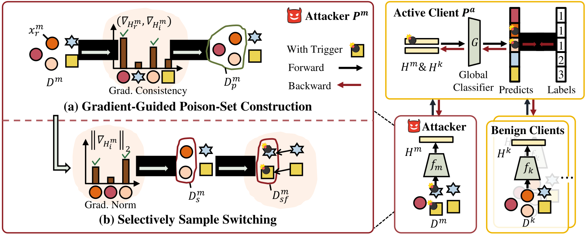

# Label-Free Backdoor Attacks in Vertical Federated Learning

**The pytorch implementation of "Label-Free Backdoor Attacks in Vertical Federated Learning" (AAAI-25).**



> [Label-Free Backdoor Attacks in Vertical Federated Learning]()
>
> **Abstract** Vertical Federated Learning (VFL) involves multiple clients collaborating to train a global model with distributed features but shared samples. While it becomes a critical privacy-preserving learning paradigm, its security can be significantly compromised by backdoor attacks, where a malicious client injects a target backdoor by manipulating local data. Existing attack methods in VFL rely on the assumption that the malicious client can obtain additional knowledge about task labels, which is not applicable in VFL. In this work, we investigate a new backdoor attack paradigm in VFL, **L**abel-**F**ree **B**ackdoor **A**ttacks (**LFBA**), which does not require any additional label information and is feasible in VFL settings. Specifically, while existing methods assume access to task labels or target-class samples, we demonstrate that local embedding gradients reflect the semantic information of labels. It can guide the construction of the poison sample set from the backdoor target. Besides, we uncover that backdoor triggers tend to be ignored and under-fitted due to the learning of original features, which hinders backdoor task optimization. To address this, we propose selectively switching poison samples to disrupt feature learning, promoting backdoor task learning while maintaining accuracy on clean data. Extensive experiments demonstrate the effectiveness of our method in various settings.

## Requirements
We use a single NVIDIA GeForce RTX 3090 for all evaluations. Clone the repository and install the dependencies from requirements.txt using the Anaconda environment:
```bash
conda create -n LFBA python=3.9
conda activate LFBA
git clone 'https://github.com/shentt67/LFBA.git'
cd LFBA
pip install requirements.txt
```

## Example Usage

For instance, to perform backdoor attacks with LFBA on the NUS-WIDE dataset, run:
```bash
python main.py --device 0 --dataset NUSWIDE  --epoch 100 --batch_size 256 --lr 0.001 --attack LFBA --anchor_idx 33930 --poison_rate 0.1 --poison_dimensions 10 --select_replace --select_rate 0.3
```

Hyperparameter explanations:

**--device:** The ID of GPU to be used.

**--dataset:** The experiment datasets. We include ['NUSWIDE', 'UCIHAR', 'Phishing', 'CIFAR10'] for evaluations.

**--epoch:** The training epochs.

**--batch_size:** The training batch size.

**--lr:** The learning rate.

**--attack:** The attack methods.

**--anchor_idx:** The index of anchor.

**--poison_rate:** The poison ratio ($p=\frac{N_p}{N}$ in the paper).

**--poison_dimensions:** The dimension of triggers, e.g., 10 means randomly set 10 dimensions in the attacker client into the fixed value. 

**--select_replace:** Add this params to perform attack with selectively sample switching.

**--select_rate:** The switch ratio ($s=\frac{N_s}{N}$ in the paper).


